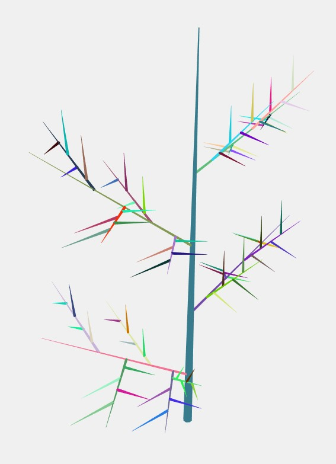

# TreeBuilder
A threejs application for building a tree with user interaction

## Requirements

Node.js

## Installation
1. Clone the repository.
2. Go to the directory.
3. run command: npm install
4. run command: npm run server
5. open 'http://localhost:3000/' in the brower
6. If you want to change the port, open server.js, at line 18, replace first parameter with the desired port number.